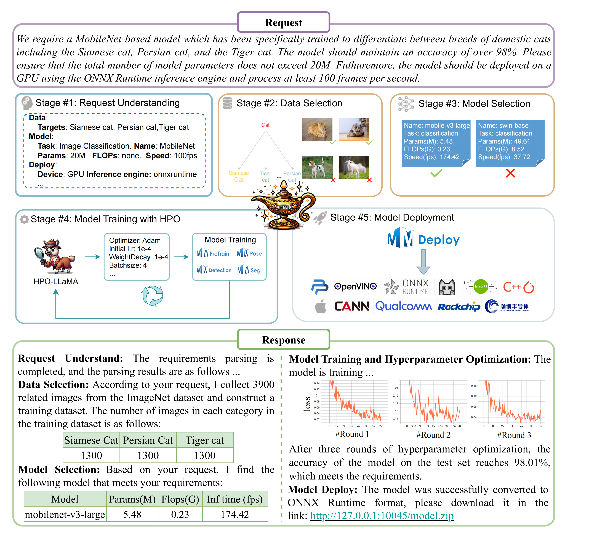

# AutoMMLab
<p align="center">
  
</p>
<p align="center">
    <b>Automatically generating deployable models from language instructions for computer vision tasks</b>
</p>

## 📖 Overview
AutoMMLab is the first request-to-model AutoML platform for computer vision tasks, which involves understanding the user’s natural language request and execute the entire workflow to output production-ready models. The whole pipeline of AutoMMLab consists of five main stages,including request understanding, data selection, model selection, model training with hyperparameter optimization (HPO), and model deployment. Based on AutoMMLab, we build a benchmark termed [LAMP](LAMP/readme.md) for evaluating end-to-end prompt-based model production, and also studying each component in the whole production pipeline.

<p align="center">
  
</p>

## 🎉 News

Jan. 29, 2024: AutoMMLab is now open source.

## 💻️ Get Started

### Installation the environment

```bash
# download the code
git clone git@github.com:yang-ze-kang/AutoMMLab.git

# create python environment
cd AutoMMLab
conda create -n autommlab python=3.9
source activate autommlab
pip install -r requirements.txt
```

### Initialize the dataset zoo
Download datsets of dataset zoo
<table><thead>
  <tr>
    <th>Task</th>
    <th>Dataset</th>
    <th>URL</th>
  </tr></thead>
<tbody>
  <tr>
    <td>Cls.</td>
    <td>ImageNet</td>
    <td><a href="https://www.image-net.org/challenges/LSVRC/index.php" target="_blank" rel="noopener noreferrer">https://www.image-net.org/challenges/LSVRC/index.php</a></td>
  </tr>
  <tr>
    <td>Det.</td>
    <td>COCO</td>
    <td><a href="https://cocodataset.org/#download" target="_blank" rel="noopener noreferrer">https://cocodataset.org/#download</a></td>
  </tr>
  <tr>
    <td>Seg.</td>
    <td>Cityscapes</td>
    <td><a href="https://www.cityscapes-dataset.com/" target="_blank" rel="noopener noreferrer">https://www.cityscapes-dataset.com//a></td>
  </tr>
  <tr>
    <td rowspan="2">Kpt.<br></td>
    <td>COCO</td>
    <td><a href="https://cocodataset.org/#download" target="_blank" rel="noopener noreferrer">https://cocodataset.org/#download</a></td>
  </tr>
  <tr>
    <td>AP-10k</td>
    <td>
    <a href="https://github.com/AlexTheBad/AP-10K?tab=readme-ov-file#download" target="_blank" rel="noopener noreferrer">https://github.com/AlexTheBad/AP-10K?tab=readme-ov-file#download</a></td>
  </tr>
</tbody>
</table>


And change the path of datasets in configuration file (automlab/configs.py) with your path.
```python
DATASET_ZOO = {
    'ImageNet':'sh1984:s3://openmmlab/datasets/classification/imagenet',
    'COCO':'sh1984:s3://openmmlab/datasets/detection/coco',
    'object365': 'sh1984:s3://openmmlab/datasets/detection/Objects365',
    'openimage': 'sh1984:s3://openmmlab/datasets/detection/coco',
    'cityscapes':'s3://openmmlab/datasets/segmentation/cityscapes',
    'ap10k':'sh1986:s3://ap10k/ap-10k/'
}
```

### RU-LLaMA and HPO-LLaMA
1. Download the base model and LoRA weights:
**Base Model:** https://huggingface.co/meta-llama/Llama-2-7b-hf/tree/main
**LoRA Weights:** https://drive.google.com/file/d/136jt458c6rMOHwDwwVS6U4iVrX9cmo1p/view?usp=drive_link

2. Change the configuration file (autommlab/configs.py) with your path.
   ```python
   PATH_LLAMA2 = 'llama_weights/llama-2-7b-hf'
   PATH_LORAS = {
       'ru-llama2':'weights/llama2_lora_weights/save_dir_reqparse_v2',
       'hpo-llama2-classification':'weights/llama2_lora_weights/hpo_classification',
       'hpo-llama2-detection':'weights/llama2_lora_weights/hpo_detection',
       'hpo-llama2-segmentation':'weights/llama2_lora_weights/hpo_segmentation',
       'hpo-llama2-pose':'weights/llama2_lora_weights/hpo_pose'
   }
   ```


### Setting the configuration
Please edit file 'autommlab/configs.py' to modify the configuration of the demo.
```python 
URL_LLAMA = "http://127.0.0.1:10068/llama2"
TRAIN_GPU_NUM = 1
RU_MODEL = 'ru-llama2'
HPO_MODEL = 'hpo-llama2'
HPO_MAX_TRY = 3
TENSORBOARD_PORT = 10066
IP_ADDRESS = 'localhost'
```

### Start Demo

```bash
export PYTHONPATH=$PYTHONPATH:$(pwd)

# step 1
# If you use RU-LLaMA and HPO-LLaMA, please deploy them first.
CUDA_VISIBLE_DEVICES=0 python autommlab/models/deploy_llama.py 

# step 2
CUDA_VISIBLE_DEVICES=1 python autommlab/main.py 
```

## 📺 Demo

[Official Demo Video](https://github.com/user-attachments/assets/c62bcee7-6e49-4323-9eab-eb514cede1d9)


## 🤝 Acknowledgments

- [MMEngine](https://github.com/open-mmlab/mmengine): OpenMMLab foundational library for training deep learning models.
- [MMCV](https://github.com/open-mmlab/mmcv): OpenMMLab foundational library for computer vision.
- [MMPreTrain](https://github.com/open-mmlab/mmpretrain): OpenMMLab pre-training toolbox and benchmark.
- [MMDetection](https://github.com/open-mmlab/mmdetection): OpenMMLab detection toolbox and benchmark.
- [MMSegmentation](https://github.com/open-mmlab/mmsegmentation): OpenMMLab semantic segmentation toolbox and benchmark.
- [MMPose](https://github.com/open-mmlab/mmpose): OpenMMLab pose estimation toolbox and benchmark.
- [MMDeploy](https://github.com/open-mmlab/mmdeploy): OpenMMLab model deployment framework.

## ⚖️ License

Codes and data are freely available for free non-commercial use, and may be redistributed under these conditions. For commercial queries, please contact Mr. Sheng Jin (jinsheng13@foxmail.com). We will send the detail agreement to you.

## 📝 Citation
To cite AutoMMLab in publications, please use the following BibTeX entrie.
```bibtex
@misc{yang2024autommlabautomaticallygeneratingdeployable,
      title={AutoMMLab: Automatically Generating Deployable Models from Language Instructions for Computer Vision Tasks}, 
      author={Zekang Yang and Wang Zeng and Sheng Jin and Chen Qian and Ping Luo and Wentao Liu},
      year={2024},
      eprint={2402.15351},
      archivePrefix={arXiv},
      primaryClass={cs.LG},
      url={https://arxiv.org/abs/2402.15351}, 
}
```
